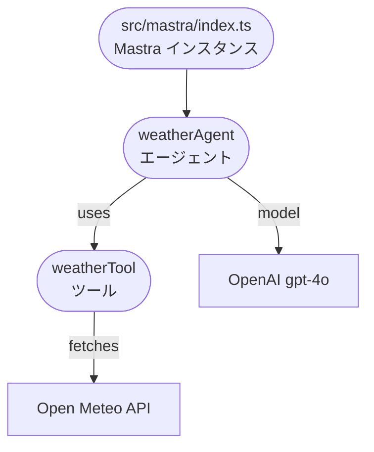

# pj-j2

このリポジトリは [Mastra](https://www.npmjs.com/package/mastra) フレームワークを用いた最小構成のサンプルです。天気情報を返す `weatherAgent` を 1 つ実装しており、TypeScript で開発して ES2022 へコンパイルします。

## ディレクトリ構成

```
├─ package.json
├─ tsconfig.json
└─ src
   └─ mastra
      ├─ index.ts          # Mastra の初期化
      ├─ agents
      │  └─ index.ts       # weatherAgent の定義
      └─ tools
         └─ index.ts       # weatherTool の実装
```

### 概要
- 開発サーバーは `npm run dev` (内部で `mastra dev` を実行) で起動します。
- `tsconfig.json` の設定によりコンパイル結果は `dist/` に出力されます。
- 現在は OpenAI の `gpt-4o` モデルと `weatherTool` を利用する `weatherAgent` のみが登録されています。

### アーキテクチャ


## 新規参加者向けメモ
- このプロジェクトは Mastra エージェントを最小限で動かす例になっています。`src/mastra/` 以下の TypeScript ソースを読むと仕組みが理解できます。
- テストフレームワークは設定されていないため、`npm test` はエラーを返します。必要に応じて独自に追加してください。
- `weatherTool` を参考に、別の API を利用したツールを作成すると機能拡張ができます。

